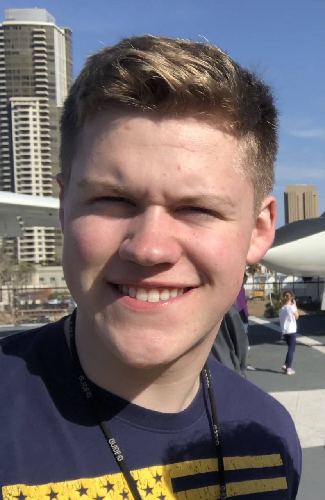

My Major
===============

Spoiler: It's Awesome
------------------------

#### Top 3 reasons I like my major:

1. The instructors understand how/why/when collaboration is important and trust
us to use it responsibly
2. The willingness for people to help is astounding
3. Technology is Awesome
4. You get to see the development of your skills in real time

------------------

The first language I 'learned' is _Python_.

There are **tons** of languages

Here is some more info on python: [Python - We don't bite](https://www.python.org/)

## My first lines of code _ever_

    print('Hello, World!')

Hello world is a pretty universal introduction to the world of coding!

Directory
-------------

[About Me](FinalProject(Intro).md) - An introduction to who I am!

[My Hobbies](FinalProjectII.md) - What I like to do!

[Summer Plans](FinalProjectIV.md) - My Summer Plans

[Future Plans](FinalProjectIII.md) - Plans for the Future

##### In case you were wondering. This is me!

